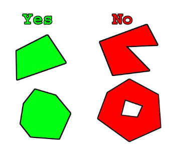

# Коллизия для модели

Упрощенная геометрия столкновений важна для оптимизации обнаружения столкновений в игре. Unreal Engine 5 предоставляет базовые инструменты для создания геометрии столкновений в редакторе **Static Mesh Editor**. Однако в некоторых случаях лучше всего создавать собственную геометрию столкновений в приложении 3D-моделирования и экспортировать ее вместе с сеткой рендеринга. Как правило, это справедливо для любой сетки с отверстием или вогнутой областью, с которой объекты не должны сталкиваться.

Например:
 - Сетки дверных проемов
 - Стены с вырезами под окна
 - Сетки необычной формы

Сети столкновений идентифицируются импортером по их названию. Синтаксис именования коллизий должен быть следующим:
 - **UBX_[RenderMeshName]\_##** Коробку (**Box**) необходимо создать с использованием обычного прямоугольного 3D-объекта. Вы не можете перемещать вершины или каким-либо образом деформировать ее, чтобы сделать ее чем-то отличным от прямоугольной призмы, иначе это не сработает.
 - **UCP_[RenderMeshName]\_##** Капсула (**Capsule**) должна представлять собой цилиндрический объект, увенчанный полусферами. Ему вообще не обязательно иметь много сегментов (8 — хорошее число), потому что он превращается в настоящую капсулу для столкновений. Как и в случае с ящиками, вам не следует перемещать отдельные вершины.
 - **USP_[RenderMeshName]\_##** Сфере (**Sphere**) вообще не обязательно иметь много сегментов (8 — хорошее число), потому что при столкновении она преобразуется в настоящую сферу. Как и в случае с ящиками, вам не следует перемещать отдельные вершины.
 - **UCX_[RenderMeshName]\_##** Выпуклый объект (**Convex**) может представлять собой любую полностью замкнутую выпуклую трехмерную фигуру. Например, коробка также может быть выпуклым объектом. На диаграмме ниже показано, что выпукло, а что нет:

:::note

Используйте **[аддон](https://github.com/scerka-soft/unreal-tools/releases)** для Blender, что бы облегчить себе работу.

:::

**[Источник информации](https://docs.unrealengine.com/5.2/en-US/fbx-static-mesh-pipeline-in-unreal-engine/#collision)**
