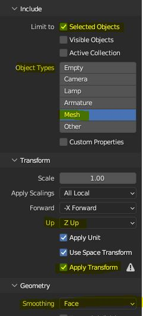

# Экспорт модели в UE

***

Для правильного экспорта модели из Blender:

 1. Выберите нужные обьекты на сцене.
 2. Выставьте каждому обьекту нужный **Pivot** (Например: x: 0 y: 0 z: 0)
 3. Нажмите на пункт ```File -> Export -> FBX (.fbx)```
 4. Выставьте настройки
	- Поставьте галку ```Selected Objects```
	- В **Object Types** выберите ```Mesh```
	- Для параметра **Up** выставьте значение ```Z Up``` (*Влияет на Pivot*)
	- Поставьте галку ```Apply Transform```
	- Для параметра **Smoothing** выставьте значение ```Face``` (*При других значениях UE ругаеться на smoothing groups*)
 5. Готово!
 


:::caution

При возникновении ошибок в UE выполните в Blender ***merge vertices*** ```ALT + M```

:::