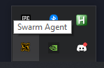
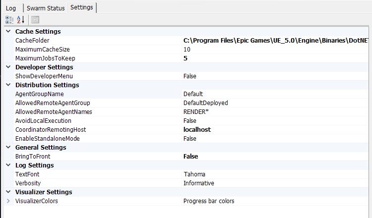

# Swarm Agent

Если **Swarm Agent** выдаёт ошибку (ниже пример) и не хочет запекать свет...

```bash
......... SwarmCoordinator failed to be initialized
```

Запустите **Swarm Agent** по пути ```UEPath\Engine\Binaries\DotNET\SwarmAgent.exe```

Зайдите в трей



В **Settings** для параметра **CoordinatorRemotingHost** выставьте значение **localhost**



Если данное действие **не помогло**, то:

Зайдите по пути ```C:\Users\AppData\Local\UnrealEngine\UE_Ver\Saved\Swarm```

В файле **SwarmAgent.DeveloperOptions.xml** для значения **LocalEnableLocalPerformanceMonitoring** выставьте **false**

:::danger

Если при запечке ```Build -> Build Lighting only``` в **UE** ничего не происходит, то в **World Settings** нужного уровня уберите галочку для значения **Force No Precomputed Lighting**

:::